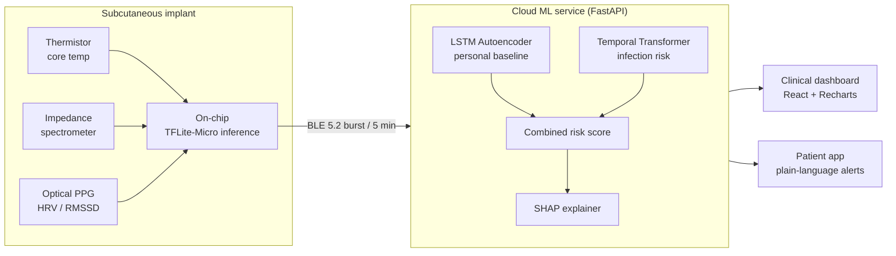

# ImmunoWatch 🩺
> Continuous AI-powered health monitoring for immunocompromised patients

[](https://github.com/apande06/immuno-watch/actions/workflows/ci.yml)
[](LICENSE)
[](pyproject.toml)

ImmunoWatch detects the **physiological precursors of infection 12–24 hours before
symptoms appear**, using three continuously-monitored biosignals and a pair of
deep models that learn each patient's *personal* baseline rather than a population
average.

---

## The Problem
500,000+ Americans live with severe immunocompromise from chemotherapy, organ
transplants, or HIV. For these patients, a bacterial infection that a healthy
immune system clears in days can become fatal within hours. Current monitoring
relies on periodic bloodwork and patient-reported symptoms — by the time a fever
appears, the infection has often been progressing for 12–24 hours. ImmunoWatch
watches the body's *leading indicators* instead of waiting for the lagging one.

---

## How It Works



The chip streams readings; the inference engine fuses a **personal-baseline
anomaly score** (40%) with a **cross-patient infection-risk score** (60%) into a
single number, maps it onto a three-tier clinical ladder, attaches a SHAP
explanation, and notifies the care team.

---

## The Three Sensors
| Sensor | Signal | Clinical significance |
|--------|--------|-----------------------|
| Thermistor | Core temperature | 0.5 °C sustained elevation above personal baseline = WATCH; ≥38.3 °C = neutropenic emergency (IDSA 2023) |
| Bioimpedance | Tissue electrical resistance | Drops during inflammation as extracellular fluid shifts occur; non-invasive WBC-activity proxy |
| Optical PPG | Heart-rate variability (RMSSD) | Autonomic stress precedes fever by 2–4 hours — the **earliest** reliable signal |

The clinical crux: **HRV degrades *before* temperature rises.** The simulator
encodes this lead explicitly, and the Transformer's attention mechanism is what
lets the model exploit it.

---

## ML Architecture

### Personal Baseline Model — LSTM Autoencoder (`ml/baseline.py`)
An encoder → 16-dim bottleneck → decoder LSTM trained **only** on a patient's
first 14 healthy days. Infection perturbs physiology in ways the model has never
seen, so reconstruction error spikes. The anomaly threshold is the 95th percentile
of reconstruction error on held-out normal data — calibrated *per patient*.
*Reference: Malhotra et al., ICML 2016.*

### Infection Risk Predictor — Temporal Transformer (`ml/predictor.py`)
Input projection → sinusoidal positional encoding → 2-layer / 4-head
TransformerEncoder → global average pooling → **three heads** (risk, severity,
time-to-event). Multi-head attention learns the cross-sensor temporal correlation
— HRV falling hours before temperature rises — that single-sensor rules miss.
Trained on **time-ordered** splits (never shuffled — that would leak the future).
*Reference: Vaswani et al., NeurIPS 2017.*

### Federated Learning (`ml/federated.py`)
FedAvg across the patient models: each "chip" trains locally and shares only
weight updates — never raw biosignals. Demonstrates the privacy architecture and
the cross-patient generalisation gain. *Reference: McMahan et al., AISTATS 2017.*

### Explainability — SHAP (`inference/explainer.py`)
Every alert is decomposed into per-sensor SHAP contributions and rendered twice:
a precise **clinical** explanation with a recommended order set, and a reassuring
plain-language **patient** explanation. *Reference: Lundberg & Lee, NeurIPS 2017.*

> **Sample CRITICAL alert (clinical):** *"Alert triggered by 3 converging abnormal
> signals: HRV (RMSSD) reduced 41.0% below baseline (primary driver, SHAP: +0.47);
> temperature elevated 0.82 °C above baseline (secondary driver, SHAP: +0.21);
> bioimpedance reduced 8.3% below baseline (tertiary driver, SHAP: +0.18). Pattern
> consistent with bacterial infection onset. Estimated 6 hours to clinical
> presentation. Recommend CBC with differential and blood cultures; clinician
> review now."*

---

## Deep Learning Stack
| Library | Role | Why |
|---------|------|-----|
| **PyTorch** | Primary framework for all training & inference | Flexibility for the custom autoencoder / Transformer; research-grade; clean ONNX export path |
| **Keras** | Prototyping comparison (notebook) | Demonstrates high-level API breadth — same LSTM side-by-side with PyTorch |
| **FastAI** | Training-efficiency demo (notebook) | Shows the same model trained in far fewer lines; built on PyTorch |
| **TFLite** | Target deployment format (`ml/export.py`) | Microcontroller runtime for on-chip inference, via ONNX → TFLite → INT8 |
| **JAX** | Future work | Path to optimised custom federated training loops at scale |

---

## Repository Layout
```
constants.py          All clinical thresholds with citations (zero magic numbers elsewhere)
exceptions.py         Typed domain errors -> precise HTTP status codes
data/                 Pydantic schemas, async SQLAlchemy DB, physiological simulator
ml/                   Preprocessing, LSTM-AE, Transformer, FedAvg, ONNX/TFLite export, evaluation
inference/            Real-time engine + SHAP explainer
api/                  FastAPI app, routers (patients / alerts / admin), RFC 7807 errors
dashboard/            React 18 + Tailwind + Recharts clinical dashboard
notebooks/            Full training walkthrough (PyTorch + Keras + FastAI + SHAP)
alembic/              Migration environment stub
```

---

## Hypothetical Hardware Spec
- **Target SoC:** Nordic nRF9161 SiP (alt: STM32WB55)
- **ML runtime:** TensorFlow Lite Micro
- **Power budget:** <50 µW continuous inference
- **Sensor interfaces:** I²C (thermistor), SPI (impedance spectrometer, e.g. AD5933), optical UART (PPG)
- **Wireless:** BLE 5.2 burst every 5 min; NFC for clinic sync
- **Form factor:** 8 mm × 12 mm subcutaneous implant

---

## Model Performance
Populated after training by `ml/predictor.py` / `ml/evaluation.py` (test-set,
time-ordered split):

| Metric | Value |
|--------|-------|
| AUC-ROC | see `models/predictor_metrics.json` |
| F1 (infection) | see `models/predictor_metrics.json` |
| Precision | see `models/predictor_metrics.json` |
| Recall | see `models/predictor_metrics.json` |

Full plots (ROC, PR, calibration, confusion matrix, reconstruction-error heatmaps,
federated comparison) are compiled into `reports/immunowatch_model_report.pdf`.

---

## Running Locally

### Prerequisites
- Python 3.10–3.12 (see note below for 3.13+/3.14)
- Node.js 18+

### One command
```bash
bash run.sh
```
This generates data, trains both models, runs the federated simulation, builds the
evaluation report, and starts the API (`:8000`) + dashboard (`:3000`).

On Windows (PowerShell):
```powershell
./run.ps1
```

### Manual steps
```bash
pip install -r requirements.txt
python data/simulator.py          # 30-day biosignal streams -> CSV + SQLite
python ml/baseline.py             # personal LSTM autoencoders
python ml/predictor.py            # infection-risk Transformer
python ml/federated.py            # FedAvg simulation
python ml/evaluation.py           # plots + PDF report
uvicorn api.main:app --reload     # API at http://localhost:8000/docs

cd dashboard && npm install && npm run dev   # http://localhost:3000
```

Then click **🦠 Simulate Infection** in the dashboard to watch the system detect an
infection event in real time as the alert escalates WATCH → WARNING → CRITICAL.

> **Python 3.13/3.14 note:** the pinned versions in `requirements.txt` are the
> reference set (known-good on 3.10–3.12). On newer interpreters some pins predate
> the available wheels — relax them (e.g. `torch>=2.3`) so pip resolves a
> compatible build for your platform.

---

## Future Work
- Clinical-trial design (IRB protocol, recruitment of an immunocompromised cohort)
- FDA 510(k) pathway analysis (candidate predicate: Abbott Confirm Rx ICM)
- **JAX** reimplementation for faster federated training at scale
- Real impedance-spectroscopy integration (AD5933) and on-bench PPG validation
- Conformal prediction for calibrated, patient-specific alert confidence

---

## License
Released under the [MIT License](LICENSE).

## Author
**Arnav Pande** — [GitHub](https://github.com/apande06)

> ImmunoWatch is a research prototype on **synthetic data**. It is not a
> medical device and must not be used for clinical decision-making.
